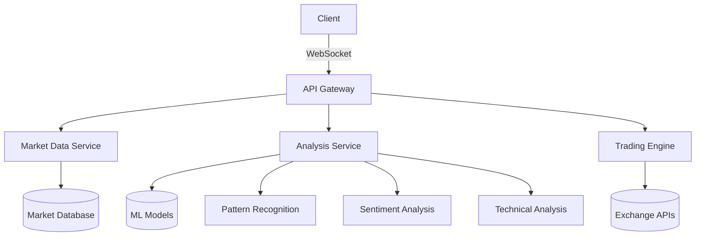

**Architecture Overview:**

- **Client**: The user's frontend (React dashboard), connects via WebSocket to the API Gateway for real-time updates and commands.
- **API Gateway**: Main entry point (FastAPI backend), routes requests to respective internal services.
- **Market Data Service**: Handles fetching and storing of live/historical data, connected to a Market Database.
- **Analysis Service**: Runs ML models and analytics (Pattern Recognition, Sentiment Analysis, Technical Analysis) using stored market data and models.
- **Trading Engine**: Executes trades using generated signals and connects to live exchange APIs (e.g., Binance, others).
- **Market Database**: Stores price/volume/indicator time series.
- **ML Models**: Persisted deep learning models for ensemble forecasting.
- **Pattern Recognition / Sentiment Analysis / Technical Analysis**: Specialized internal submodules of the Analysis Service.
- **Exchange APIs**: External broker/exchange connections for order execution.

For full-stack integration, the FastAPI backend acts as the *API Gateway*, exposing REST and WebSocket endpoints, and orchestrates calls to Market Data, ML Analysis, and Trading Engine components.